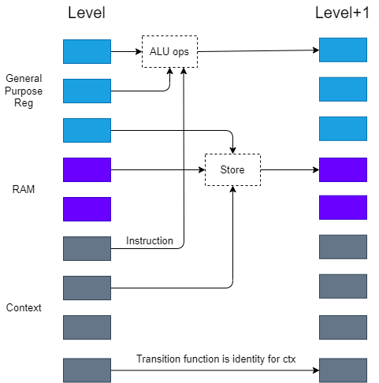

This is a unique virtual machine that executes in parallel with each register, ROM, RAM. First, assign a thread to each register, code segment (ROM), and read and write data segment (RAM). They will be executed from the 0th layer to the next state, and there will be several processes waiting for data preparation.For example, the R1 register, its next state will be determined by the R-type instruction and the I-type instruction. According to the different instructions, the preparation state of different data will be inquired, such as add ra, rb, the state transfer function will first determine the first operand Whether it is r1, if it is, it will wait for the readiness of the previous state of rb, and then perform the calculation. The program flow is shown in the figure


The instruction set is as follows

> - R [00000]: add ra, rb
> - R [00001]: sub ra, rb
> - R [00010]: mov ra, rb
> - R [00011]: xor ra, rb

> - I [01000]: add ra, imm
> - I [01001]: sub ra, imm
> - I [01010]: mov ra, imm
> - I [01011]: lsh ra, imm
> - I [01100]: rsh ra, imm

> - B [01111]: jne ra, imm

> - R [10000]: ld ra, [rb]
> - R [10001]: st ra, [rb]

> - Z [11100]: write r0
> - Z [11101]: read r0
> - E [11111]: exit

r0~r9:32bit

pc:32bit

context:1024 Byte

RAM:200 Byte

The assembly code is as follows

```nasm
movi    r1,8
loop1:
read    r0
subi    r1,1
st      r0,[r1]
jne     r1,loop1

xor     r2,r2
movi    r3,40503
lsh     r3,16
movi    r4,31161
xor     r3,r4

movi    r1,4
xor     r4,r4
loop2:
ld      r5,[r1]
lsh     r4,8
xor     r4,r5
addi    r1,1
mov     r5,r1
subi    r5,8
jne     r5,loop2

movi    r1,0
xor     r5,r5
loop3:
ld      r6,[r1]
lsh     r5,8
xor     r5,r6
addi    r1,1
mov     r6,r1
subi    r6,4
jne     r6,loop3
# r4=x,r5=y,r2=sum,r3=data

movi    r1,32
loop4:
add     r2,r3

mov     r6,r5
lsh     r6,4

movi    r0,4
xor     r7,r7
loop5:
addi    r0,7
lsh     r7,8
ld      r8,[r0]
xor     r7,r8
subi    r0,8
jne     r0,loop5  # r7=key[0]

add     r6,r7
mov     r7,r2
add     r7,r5
xor     r6,r7
mov     r7,r5
rsh     r7,5

movi    r0,4
xor     r8,r8
loop6:
addi    r0,11
lsh     r8,8
ld      r9,[r0]
xor     r8,r9
subi    r0,12
jne     r0,loop6  # r8=key[1]

add     r7,r8
xor     r6,r7
add     r4,r6


mov     r6,r4
lsh     r6,4

movi    r0,4
xor     r7,r7
loop7:
addi    r0,15
lsh     r7,8
ld      r8,[r0]
xor     r7,r8
subi    r0,16
jne     r0,loop7  # r7=key[2]

add     r6,r7
mov     r7,r2
add     r7,r4
xor     r6,r7
mov     r7,r4
rsh     r7,5

movi    r0,4
xor     r8,r8
loop8:
addi    r0,19
lsh     r8,8
ld      r9,[r0]
xor     r8,r9
subi    r0,20
jne     r0,loop8  # r8=key[3]

add     r7,r8
xor     r6,r7
add     r5,r6

subi    r1,1
jne     r1,loop4


movi    r2,14265
lsh     r2,16
movi    r3,60307
xor     r2,r3
sub     r4,r2
jne     r4,fail

movi    r2,49021
lsh     r2,16
movi    r3,29765
xor     r2,r3
sub     r5,r2
jne     r5,fail

movi    r1,24
ld      r0,[r1]
write   r0
addi    r1,1
ld      r0,[r1]
write   r0
addi    r1,1
ld      r0,[r1]
write   r0
addi    r1,1
ld      r0,[r1]
write   r0
exit

fail:
movi    r1,28
ld      r0,[r1]
write   r0
addi    r1,1
ld      r0,[r1]
write   r0
addi    r1,1
ld      r0,[r1]
write   r0
addi    r1,1
ld      r0,[r1]
write   r0
exit

```

A simple analysis shows that it is a simple tea encryption comparison, take out the key (assigned during the initialization process of the program) and the final comparison data, and do tea decryption.

```python
from ctypes import *

def decrypt(v, k):
    v0, v1 = c_uint32(v[0]), c_uint32(v[1])
    delta = 0x9e3779b9 
    k0, k1, k2, k3 = k[0], k[1], k[2], k[3]

    total = c_uint32(delta * 32)
    for i in range(32):                       
        v1.value -= ((v0.value<<4) + k2) ^ (v0.value + total.value) ^ ((v0.value>>5) + k3) 
        v0.value -= ((v1.value<<4) + k0) ^ (v1.value + total.value) ^ ((v1.value>>5) + k1)  
        total.value -= delta

    return v0.value, v1.value   

from libnum import n2s

# test
if __name__ == "__main__":
    value = [0xfab8d0f8, 0x9ac5ea91]
    key = [0x1, 0x5, 0x8, 0xf]
  
    res = decrypt(value, key)
    print("Decrypted data is : ", hex(res[0]), hex(res[1]))
    print("Flag is : %s"%(n2s(res[0])[::-1]+n2s(res[1])[::-1]).decode())

```

flag:`sl!c3Ye5`

sumbite flag is:`flag{sl!c3Ye5}`