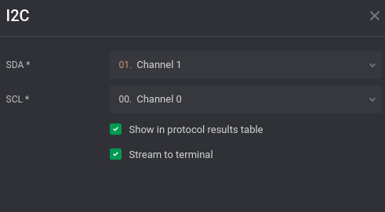
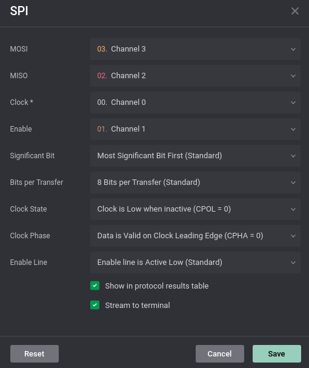
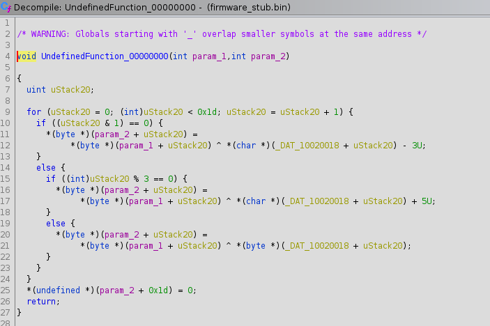

# A Different Type of Serial Key

## Overview

Topics Covered:
* I2C and SPI Serial Traffic
* Saleae Logic Captures
* S-Records
* PowerPC Reverse Engineering

Challenge Information:
* Flag: flag{s3r14l_ch4ll3ng3_s0lv3r}
* Attachments: capture.sal, key.sal

## Prompt

Attached are serial captures of two different uploads to an embedded device. One of these uploads is a key and the other is a function block.

Your goal is to decode the serial traffic, extract the key and function block, and use these to find the flag.

The flag will be in format flag{}.

## Solution

### Decoding Serial Traffic

If you are unfamiliar with serial captures, it may not be immediately obvious how to open these .sal files. However, if you extract one of these .sal files and look into any of the .bin files, you will notice a name "Saleae" at the top. A web search for Saleae will quickly bring you to their homepage which contains their software Saleae Logic: https://www.saleae.com/downloads/.

#### Extracting the Key (key.sal)

If familiar with serial traffic, this looks very much like I2C traffic, but may require some web searching if not as familiar with serial traffic. Luckily, Logic comes in with a built in I2C analyzer which we can select by opening the "Analyzers" tab on the right side of the application.

Selecting the I2C option will open the following menu. We can set the settings as follows:



Now that we have our SPI analyzers enabled, we will see the Data table populated. We can export this data to TXT/CSV file to get a better look at this data via the SPI settings menu.

This will export it to a CSV file with 6 columns (time, packet_id, address, data, read/write, and ack/nak). Since we really only care about the Data column, we can remove the other columns and extract the information we need in an easier to read format:

`print(" ".join(line.split(",")[3] for line in open("i2c.csv","r").readlines()[1:]))`

Which will output the following:

`0x59 0x57 0x72 0x31 0x79 0xCE 0x94 0x8D 0x15 0xD4 0x54 0x02 0x7C 0x5C 0xA0 0x83 0x3D 0xAC 0xB7 0x2A 0x17 0x67 0x76 0x38 0x98 0x8F 0x69 0xE8 0xD0`

We don't know exactly what this is and how it fits in yet, but appears to be a key based on the name.
#### Extracting the Function Block (capture.sal)

After opening the capture.sal file in Saleae Logic, you can see there are two different data transfers in this file. Both seem to follow the same kind of pattern with Channel 0 staying relatively Clock-like, Channel 1 going low before the transfer and high otherwise, Channel staying low always, and Channel 3 changing quite a bit at the same time as the clock.

If familiar with serial traffic, this looks very much like SPI traffic, but may require some web searching if not as familiar with serial traffic. Luckily, Logic comes in with a built in SPI analyzer which we can select by opening the "Analyzers" tab on the right side of the application.

Selecting the SPI option will open the following menu. Using what we know about SPI and the 4 channels, we can set the channels as follows while keeping the other settings default:



Now that we have our SPI analyzers enabled, we will see the Data table populated. We can export this data to TXT/CSV file to get a better look at this data via the SPI settings menu.

This will export it to a CSV file with 4 columns (time, packet_id, MOSI, and MISO). Since we really only care about the MOSI column, we can remove the other columns and extract the information we need in an easier to read format, knowing there are two different transfer blocks in this data based on the timeline in Saleae Logic:

```python
import binascii 

lines = open("spi_data.csv","r").readlines()

block_1 = b"".join(binascii.unhexlify(line.split(",")[2][2:]) for line in lines[1:111])
print("Block 1:\n{}\n".format(block_1.decode()))
block_2 = b"".join(binascii.unhexlify(line.split(",")[2][2:]) for line in lines[111:])
print("Block 2:\n{}\n".format(block_2.decode()))
```

This will output the following:
```
Block 1:
S00C00004C6F63616C204B6579BF
S221020018423B165105BDAAFF27DB3B5D223497EA549FDC4D27330808F7F95D95B0EC
S5030001FB

Block 2:
S0210000506F77657250432042696720456E6469616E2033322D42697420537475620E
S12304EC9421FFD093E1002C7C3F0B78907F000C909F000839200000913F001C4800012C7E
S123050C813F001C552907FE2F890000409E0058813F001C815F000C7D2A4A1489290000FF
S123052C7D2A07743D20100281090018813F001C7D284A14892900003929FFFD5529063EC7
S123054C7D2907747D494A787D280774813F001C815F00087D2A4A14550A063E9949000074
S123056C480000BC815F001C3D205555612955567D0A48967D49FE707D2940501D29000317
S123058C7D2950502F890000409E0058813F001C815F000C7D2A4A14892900007D2A077476
S12305AC3D20100281090018813F001C7D284A1489290000392900055529063E7D2907743F
S12305CC7D494A787D280774813F001C815F00087D2A4A14550A063E99490000480000408D
S12305EC813F001C815F000C7D2A4A14890900003D20100281490018813F001C7D2A4A145A
S123060C89490000813F001C80FF00087D274A147D0A5278554A063E99490000813F001CA1
S123062C39290001913F001C813F001C2F89001C409DFED0813F00083929001D3940000040
S11B064C9949000060000000397F003083EBFFFC7D615B784E80002060
S503000CF0
```

moat testing comment: For those unfamiliar with S-Records, you may find more info at the link below. The prefix 'S' may hint challengers to look at file type, while the # may hint a the record purpose. https://en.wikipedia.org/wiki/SREC_(file_format)

### Extracting Binary from S-Records

Either web search, or prior knowledge will eventually lead you to S-Records.

If we save Block 1 to block1.srec and Block 2 to block2.srec, we can utilize the "srecord" package to get more information out of these S-Records (https://linux.die.net/man/1/srec_examples).

Running `srec_info` on these two files will produce the following:

```
$ srec_info block1.srec
Format: Motorola S-Record
Header: "Local Key"
srec_info: block1.srec: 4: warning: no execution start address record
Data:   020018 - 020034
$ srec_info block2.srec 
Format: Motorola S-Record
Header: "PowerPC Big Endian 32-Bit Stub"
srec_info: block2.srec: 15: warning: no execution start address record
Data:   04EC - 0663
```

The header fields give a little more information about these S-Records, we know one is yet another type of key and the other is the firmware block we are looking for. We can then extract these S-Records to binary formats:

`srec_cat block1.srec -offset - -minimum-addr block1.srec -o srecord_key.bin -binary`
`srec_cat block2.srec -offset - -minimum-addr block2.srec -o firmware_stub.bin -binary`

moat testing comment: If you receive a "warning: no execution start address record" error, try using the following command <srec_cat block1.srec -offset - -minimum-addr=1 block1.srec -o srecord_key.bin -binary>.

### Decoding Firmware Stub

file, strings, and binwalk all don't show us any information for either of these .bin files, so we can take a closer look at the hexdump:

```
$ xxd srecord_key.bin 
00000000: 423b 1651 05bd aaff 27db 3b5d 2234 97ea  B;.Q....'.;]"4..
00000010: 549f dc4d 2733 0808 f7f9 5d95 b0         T..M'3....]..
$ xxd firmware_stub.bin 
00000000: 9421 ffd0 93e1 002c 7c3f 0b78 907f 000c  .!.....,|?.x....
00000010: 909f 0008 3920 0000 913f 001c 4800 012c  ....9 ...?..H..,
00000020: 813f 001c 5529 07fe 2f89 0000 409e 0058  .?..U)../...@..X
00000030: 813f 001c 815f 000c 7d2a 4a14 8929 0000  .?..._..}*J..)..
00000040: 7d2a 0774 3d20 1002 8109 0018 813f 001c  }*.t= .......?..
00000050: 7d28 4a14 8929 0000 3929 fffd 5529 063e  }(J..)..9)..U).>
00000060: 7d29 0774 7d49 4a78 7d28 0774 813f 001c  }).t}IJx}(.t.?..
00000070: 815f 0008 7d2a 4a14 550a 063e 9949 0000  ._..}*J.U..>.I..
00000080: 4800 00bc 815f 001c 3d20 5555 6129 5556  H...._..= UUa)UV
00000090: 7d0a 4896 7d49 fe70 7d29 4050 1d29 0003  }.H.}I.p})@P.)..
000000a0: 7d29 5050 2f89 0000 409e 0058 813f 001c  })PP/...@..X.?..
000000b0: 815f 000c 7d2a 4a14 8929 0000 7d2a 0774  ._..}*J..)..}*.t
000000c0: 3d20 1002 8109 0018 813f 001c 7d28 4a14  = .......?..}(J.
000000d0: 8929 0000 3929 0005 5529 063e 7d29 0774  .)..9)..U).>}).t
000000e0: 7d49 4a78 7d28 0774 813f 001c 815f 0008  }IJx}(.t.?..._..
000000f0: 7d2a 4a14 550a 063e 9949 0000 4800 0040  }*J.U..>.I..H..@
00000100: 813f 001c 815f 000c 7d2a 4a14 8909 0000  .?..._..}*J.....
00000110: 3d20 1002 8149 0018 813f 001c 7d2a 4a14  = ...I...?..}*J.
00000120: 8949 0000 813f 001c 80ff 0008 7d27 4a14  .I...?......}'J.
00000130: 7d0a 5278 554a 063e 9949 0000 813f 001c  }.RxUJ.>.I...?..
00000140: 3929 0001 913f 001c 813f 001c 2f89 001c  9)...?...?../...
00000150: 409d fed0 813f 0008 3929 001d 3940 0000  @....?..9)..9@..
00000160: 9949 0000 6000 0000 397f 0030 83eb fffc  .I..`...9..0....
00000170: 7d61 5b78 4e80 0020                      }a[xN.. 
```

Neither of these files are that large, and the first one really does look to just be a key variable, similar to the one we pulled from the I2C traffic. We also can see it is the same exact length as the key from the I2C traffic so they are most likely related and utilized in the function stub.

As far as firmware_stub.bin is concerned, the header file from the S-Record said it was a PowerPC Big Endian 32-bit Stub. Therefore, if we load it into Ghidra with the following settings we should be able to disassemble/decompile it:


Ghidra doesn't initially load or disassemble everything, because it is just a function block and not an entire binary/program. However, if we hover over the first line and tell it to disassemble (hit "D" or right click and select "Disassemble"), Ghidra will disassemble the PowerPC function block and decompile it into a pretty easily readable function.



From here, it is pretty trivial reverse engineering to determine this takes an input (param_1) and an output (param_2) and utilizes data located at 10020018. Even though we don't have access to the full firmware, we already know what data exists at that location thanks to the S-Record data for the srecord_key as that S-Record said to put that data at offset 0x20018.

We can guess the input for this function is the key we extracted from the I2C traffic. Knowing the key, function stub code, and data that exists at 0x20018, we can find the output of this function to find the flag:

### Python Code to Solve

```python
i2c_key = "\x59\x57\x72\x31\x79\xce\x94\x8d\x15\xd4\x54\x02\x7c\x5c\xa0\x83\x3d\xac\xb7\x2a\x17\x67\x76\x38\x98\x8f\x69\xe8\xd0"
srecord_key = "\x42\x3b\x16\x51\x05\xbd\xaa\xff\x27\xdb\x3b\x5d\x22\x34\x97\xea\x54\x9f\xdc\x4d\x27\x33\x08\x08\xf7\xf9\x5d\x95\xb0"

flag = ""
for i in range(len(i2c_key)):
    if i % 2 == 0:
        flag += chr(ord(i2c_key[i])^(ord(srecord_key[i])-3))
    elif i % 3 == 0:
        flag += chr(ord(i2c_key[i])^(ord(srecord_key[i])+5))
    else:
        flag += chr(ord(i2c_key[i])^(ord(srecord_key[i])))
print(flag)
```

Flag: **flag{s3r14l_ch4ll3ng3_s0lv3r}**
