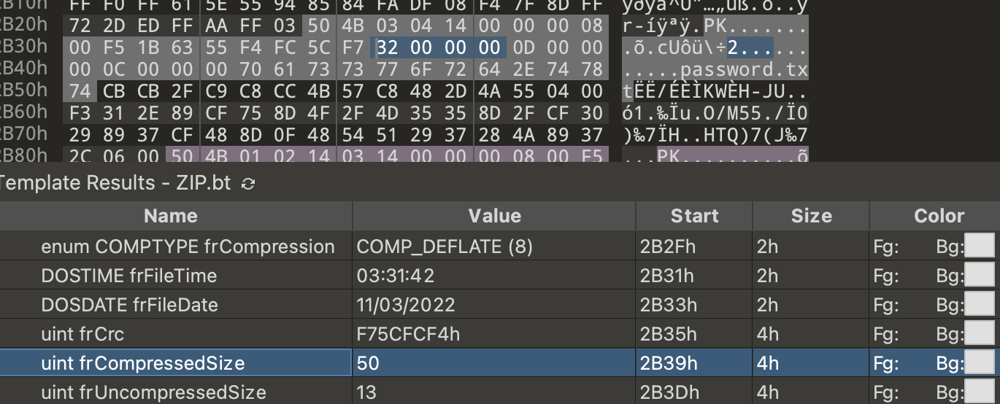

# M4st3r

First we get a zip, unzip to get the encrypted flag.zip and a password.txt



If we use 010editor to view, we will find that the compressed size of password.txt is significantly too large, with 50 bytes

```
CBCB2FC9C8CC4B57C8482D4A550400F3312E89CF758D4F2F4D35358D2FCF30298937CF488D0F4854512937284A89372C0600
```

Considering that zip uses deflate compression, then let's decompress and compress with python

```python
import zlib

data = bytes.fromhex(
    'CBCB2FC9C8CC4B57C8482D4A550400F3312E89CF758D4F2F4D35358D2FCF30298937CF488D0F4854512937284A89372C0600')
# decompress a raw stream with no header or trailer
res = zlib.decompress(data, -8)
print(res)  # b'nothing here!'
# compress data with no header and trailer
com = zlib.compressobj(level=9, wbits=-15)
recom = com.compress(res) + com.flush()
print(recom.hex())# cbcb2fc9c8cc4b57c8482d4a550400
```

Obviously, there is still some data after the password.txt compressed data, then we manually decompress it, then we can get the password

```python
import zlib

data = bytes.fromhex(
    'CBCB2FC9C8CC4B57C8482D4A550400F3312E89CF758D4F2F4D35358D2FCF30298937CF488D0F4854512937284A89372C0600')
# decompress a raw stream with no header or trailer
res = zlib.decompress(data, -8)
print(res)  # b'nothing here!'
# compress data with no header and trailer
com = zlib.compressobj(level=9, wbits=-15)
recom = com.compress(res) + com.flush()
print(recom.hex())# cbcb2fc9c8cc4b57c8482d4a550400
# compress extra data
assert data.startswith(recom)
data = data.replace(recom, b'')
res = zlib.decompress(data, -8)
print(res)  # b'L3t_mE_gue55_wh4t_7he_Pa$$w0rd_1s'
```

Use `L3t_mE_gue55_wh4t_7he_Pa$$w0rd_1s` to decompress flag.zip to get a png image, then in the png file, perform a simple pngcheck, we can get a chunk of size 0x200, and notice that the filter type in front of the png only exists 0 and 1

```python
import png

img = open('flag.png', 'rb')
img = png.Reader(file=img)
img.preamble()


def iteridat(reader: png.Reader, lenient=False):
    """Iterator that yields all the ``IDAT`` chunks as strings."""
    while True:
        type, data = reader.chunk(lenient=lenient)
        if type == b'IEND':
            break
        if type != b'IDAT':
            continue
        yield data


raw = png.decompress(iteridat(img))
a, filters = bytearray(), []
for some_bytes in raw:
    a.extend(some_bytes)
    while len(a) >= img.row_bytes + 1:
        filters.append(a[0])
        scanline = a[1: img.row_bytes + 1]
        del a[: img.row_bytes + 1]

filter_str = ''.join([str(i) for i in filters])
print(filter_str)
# 011001100110110001100001011001110111101100110111011010000011001101011111011011010011010001110011011101000011001101110010010111110011000001100110010111110111000001101110214211144032324341014411213332440122241201212144013020201333033224103323130220112442010223044334130221343440134443023232144333341102213023133021022134132030024213424233103334314122420441140133022012103034412212010224400143212234310431221144142442230142400000441141140112331214320100003442301444043403013203234213024201010401001103221402011443110312023213133212043200234423303324421324042124201102233032222334240333421020341040134431
```

When we notice 01100110, the obvious ASCII code 'f', convert each to get the first half of the flag

```
flag{7h3_m4st3r_0f_pn
```

Another part of the flag, think of deflate compression in the previous zip, and deflate compression also exists in png (see [RFC2083](https://www.rfc-editor.org/rfc/rfc2083.html#page- 29)). In png, a zlib compressed stream is usually divided into multiple parts and stored in multiple idat chunks, and generally, the zlib compressed stream of png only contains one deflate data compression block. In this png, if you are very concerned about the zlib data stream, then at the end of the last idat of png, you will find that this zlib data stream contains multiple deflate blocks


Then obviously, the data is hidden in these multiple compressed blocks, you can read zlib's [rfc document](https://www.rfc-editor.org/rfc/rfc1950) to implement one, of course, you can also use ready-made tools Such as https://github.com/nayuki/Simple-DEFLATE-decompressor, and then modify the code yourself, the final compression method is as follows

```
1, 0, 1, 0, 2, 0, 2, 0, 2, 0, 1, 0, 1, 0, 2, 0, 1, 0, 2, 0, 1, 0, 2, 0, 2, 0, 2, 0, 2, 0, 2, 0, 1, 0, 1, 0, 2, 0, 2, 0, 1, 0, 2, 0, 1, 0, 2, 0, 1, 0, 2, 0, 2, 0, 2, 0, 1, 0, 2, 0, 1, 0, 1, 0, 1, 0, 2, 0, 2, 0, 2, 0, 1, 0, 1, 0, 2, 0, 1, 0, 1, 0, 2, 0, 2, 0, 2, 0, 1, 0, 2, 0, 1, 0, 2, 0, 1, 0, 2, 0, 2, 0, 1, 0, 1, 0, 1, 0, 2, 0, 2, 0, 1, 0, 1, 0, 2, 0, 2, 0, 1, 0, 2, 0, 2, 0, 2, 0, 1, 0, 2, 0, 2, 0, 2, 0, 1, 0, 2, 0, 1, 0, 2, 0, 1, 0, 2, 0, 2, 0, 2, 0, 1, 0, 1, 0, 2, 0, 1, 0, 1, 0, 1, 0, 2, 0, 2, 0, 1, 0, 1, 0, 2, 0, 2, 0, 1, 0, 2, 0, 1, 0, 2, 0, 2, 0, 2, 0, 2, 0, 2, 0, 1, 0, 1, 0, 2, 0, 2, 0, 1, 0, 1, 0, 1, 0, 2, 0, 1, 0, 2, 0, 2, 0, 2, 0, 1, 0, 1, 0, 2, 0, 2, 0, 1, 0, 2, 0, 1, 0, 2, 0, 2, 0, 2, 0, 2, 0, 2, 0, 1, 0, 2, 0, 2, 0, 2, 0, 2, 0, 1, 0, 1, 0, 2, 0, 1, 0, 1, 0, 2, 0, 2, 0, 1, 0, 1, 0, 1, 0, 1, 0, 1, 0, 2, 0, 2, 0, 2, 0, 1, 0, 2, 0, 1, 0, 2, 0, 1, 0, 2, 0, 2, 0, 2, 0, 1, 0, 1, 0, 2, 0, 1, 0, 1, 0, 1, 0, 2, 0, 2, 0, 1, 0, 2, 0, 1, 0, 2, 0, 1, 0, 2, 0, 2, 0, 2, 0, 2, 0, 2, 0, 1, 0, 2, 0, 2, 0, 2, 0, 2, 0, 2, 0, 2, 0, 2, 0, 2, 0, 2, 0, 2, 0, 2, 0, 2, 0, 2, 0, 2, 0, 2, 0, 2, 0, 2, 0, 2, 0, 2, 0, 2, 0, 2, 0, 2, 0, 2, 0, 2, 0, 2, 0, 2, 0, 2, 0, 2, 0, 2, 0, 2, 0, 2, 0, 2, 0, 2, 0, 2, 0, 2, 0, 2, 0, 2, 0, 2, 0, 2, 0, 2, 0, 2, 0, 2, 0, 2, 0, 2, 0, 2, 0, 2, 0, 2, 0, 2, 0, 2, 0, 2, 0, 2, 0, 2, 0, 2, 0, 2, 0, 2, 0, 2, 0, 2, 0, 2, 0, 2, 0, 2, 0, 2, 0, 2, 0, 2, 0, 2, 0, 2, 0, 2, 0, 2, 0, 2, 0, 2, 0, 2, 0, 2, 0, 2, 0, 2, 0, 2, 0, 2, 0, 2, 0, 2, 0, 2, 0, 2, 0, 2, 0, 2, 0, 2, 0, 2, 0, 2, 0, 2, 0, 2, 0, 2, 0, 2, 0, 2, 0, 2, 0, 2, 0, 2, 0, 2, 0, 2, 0, 2, 0, 2, 0, 2, 0, 2, 0, 2, 0, 2, 0, 2, 0, 2, 0, 2, 0, 2, 0, 2, 0, 2, 0, 2, 0, 2, 0, 2, 0, 2, 0, 2, 0, 2, 0, 2, 0, 2, 0, 2, 0, 2, 0, 2, 0, 2, 0, 2, 0, 2, 0, 2, 0, 2, 0, 2, 0, 2, 0, 2, 0, 2, 0, 2, 0, 2, 0, 2, 0, 2, 0, 2, 0, 2, 0, 2, 0, 2, 0, 2, 0, 2, 0, 2, 0, 2, 0, 2, 0, 2, 0, 2, 0, 2, 0, 2, 0, 2, 0, 2, 0, 2, 0, 2, 0, 2, 0, 2, 0, 2, 0, 2, 0, 2, 0, 2, 0, 2, 0, 2, 0, 2, 0, 2, 0, 2, 0, 2, 0, 2, 0, 2, 0, 2, 0, 2, 0, 2, 0, 2, 0, 2, 0, 2, 0, 2, 0, 2, 0, 2, 0, 2, 0, 2, 0, 2, 0, 2, 0, 2, 0, 2, 0, 2, 0, 2, 0, 2, 0, 2, 0, 2, 0, 2, 0, 2, 0, 2, 0, 2, 0, 2, 0, 2, 0, 2, 0, 2, 0, 2, 0, 2, 0, 2, 0, 2, 0, 2, 0, 2, 0, 2, 0, 2, 0, 2, 0, 2, 0, 2, 0, 2, 0, 2, 0, 2, 0, 2, 0, 2, 0, 2, 0, 2, 0, 2, 0, 2, 0, 2, 0, 2, 0, 2, 0, 2, 0, 2, 0, 2, 0, 2, 0, 2, 0, 2, 0, 2, 0, 2, 0, 2, 0, 2, 0, 2, 0, 2, 0, 2, 0, 2, 0, 2, 0, 2, 0, 2, 0, 2, 0, 2, 0, 2, 0, 2, 0, 2, 0, 2, 0, 2, 0, 2, 0, 2, 0, 2, 0, 2, 0, 2, 0, 2, 0, 2, 0, 2, 0, 2, 0, 2, 0, 2, 0, 2, 0, 2, 0, 2, 0, 2, 0, 2, 0, 2, 0, 2, 0, 2, 0, 2, 0, 2, 0, 2, 0, 2, 0, 2, 0, 2, 0, 2, 0, 2, 0, 2, 0, 2, 0, 2, 0, 2, 0, 2, 0, 2, 0, 2, 0, 2, 0, 2, 0, 2, 0, 2, 0, 2, 0, 2, 0, 2, 0, 2, 0, 2, 0, 2, 0, 2, 0, 2, 0, 2, 0, 2, 0, 2, 0, 2, 0, 2, 0, 2, 0, 2, 0, 2, 0, 2, 0, 2, 0, 2, 0, 2, 0, 2, 0, 2, 0, 2, 0, 2, 0, 2, 0, 2, 0, 2, 0, 2, 0, 2, 0, 2, 0, 2, 0, 2, 0, 2, 0, 2, 0, 2, 0, 2, 0, 2, 0, 2, 0, 2, 0, 2, 0, 2, 0, 2, 0, 2, 0, 2, 0, 2, 0, 2, 0, 2, 0, 2, 0, 2, 0, 2, 0, 2, 0, 2, 0, 2, 0, 2, 0, 2, 0, 2, 0, 2, 0, 2, 0, 2, 0, 2, 0, 2, 0, 2, 0, 2, 0, 2, 0, 2, 0, 2, 0, 2, 0, 2, 0, 2, 0, 2, 0, 2, 0, 2, 0, 2, 0, 2, 0, 2, 0, 2, 0, 2, 0, 2, 0, 2, 0, 2, 0, 2, 0, 2, 0, 2, 0, 2, 0, 2, 0, 2, 0, 2, 0, 2, 0, 2, 0, 2, 0, 2, 0, 2, 0, 2, 0, 2, 0, 2, 0, 2, 0, 2, 0, 2, 0, 2, 0, 2, 0, 2, 0, 2, 0, 2, 0, 2, 0, 2, 0, 2, 0, 2, 0, 2, 0, 2, 0, 2, 0, 2, 0, 2, 0, 2, 0, 2, 0, 2, 0, 2, 0, 2, 0, 2, 0, 2, 0, 2, 0, 2, 0, 2, 0, 2, 0, 2, 0, 2, 0, 2, 0, 2, 0, 2, 0, 2, 0, 2, 0, 2, 0, 2, 0, 2, 0, 2, 0, 2, 0, 2, 0, 2, 0, 2, 0, 2, 0, 2, 0, 2, 0, 2, 0, 2, 0, 2, 0, 2, 0, 2, 0, 2, 0, 2, 0, 2, 0, 2, 0, 2, 0, 2, 0, 2, 0, 2, 0, 2, 0, 2, 0, 2, 0, 2, 0, 2, 0, 0]
```

Let's ignore all 0s, and then convert the 1 and 2 values to binary to get the final flag

```
9_5truc7ur3_1s_y0ur5}
```

Then the complete flag is

```
flag{7h3_m4st3r_0f_pn9_5truc7ur3_1s_y0ur5}
```
